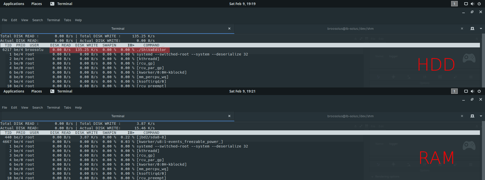

# shivaLog2Ram
These scripts redirect ShiVa Editor logging from a folder on your HDD to RAM. This avoids potential performance bottle necks if you log a lot, but it was primarily written to calm down my drives and extend HDD lifetime by avoiding constant shredding.

# Installation
Log2Ram alters the startup procedure of the ShiVa Editor by creating a RamDisk, then moving the log file onto it and creating a symlink in place where the log folder would normally be. Because of those modifications, it is required to run Log2Ram every time you want to start ShiVa.

## Windows
Unfortunately, Windows is the most difficult system to make it work. ImDisk is required. If ImDisk is not already installed on your machine, the included installer will run the fist time you try to run Log2Ram.

Copy all the contents of the "Windows" folder in this repository to your ShiVa installation folder. Run "Log2Ram.bat" to start ShiVa from now on.

Log2Ram works with both ShiVa 1.9.2 and 2.0 on Windows, 32bit and 64bit.

## macOS
Requires ShiVa 2.0 to be installed in /Applications.

Copy "ShiVa Editor Log2Ram.app" to your system and run this app.

## Linux
Requires a Linux distribution with /dev/shm preconfigured (most modern distributions do this by default).

- Option a) Copy "Log2Ram.sh" to your hard drive and run it, then run ShiVa 2.0 as usual.
- Option b) replace "ShiVaEditor.sh" in the ShiVa 2.0 install directory with my file, and run ShiVa 2.0 as usual.

# Removal
If you want to go back to HDD logging, you can remove Log2Ram using the following procedures.

## Windows
- Remove Log2Ram.bat and the "Log2RamFiles" folder from your ShiVa installation folder.
- ShiVa 1.9.2: delete ShiVaInstallationFolder/Logs (looks like a shortcut)
- ShiVa 2.0: delete %LOCALAPPDATA%/ShiVa/Editor/Log (looks like a shortcut)

## macOS
- Remove "ShiVa Editor Log2Ram.app" from your system.
- Delete "~/Library/Application\ Support/ShiVa/Editor/Log"

## Linux
- Remove "~/.shiva/ShiVa/Editor/Log"
- Restore the original "ShiVaEditor.sh" script if you altered it

# Screenshot
Both images show ShiVa 2.0 on Linux logging thousands of short log messages per frame at 60 FPS. Using Log2Ram, the logging activity does not even register.

